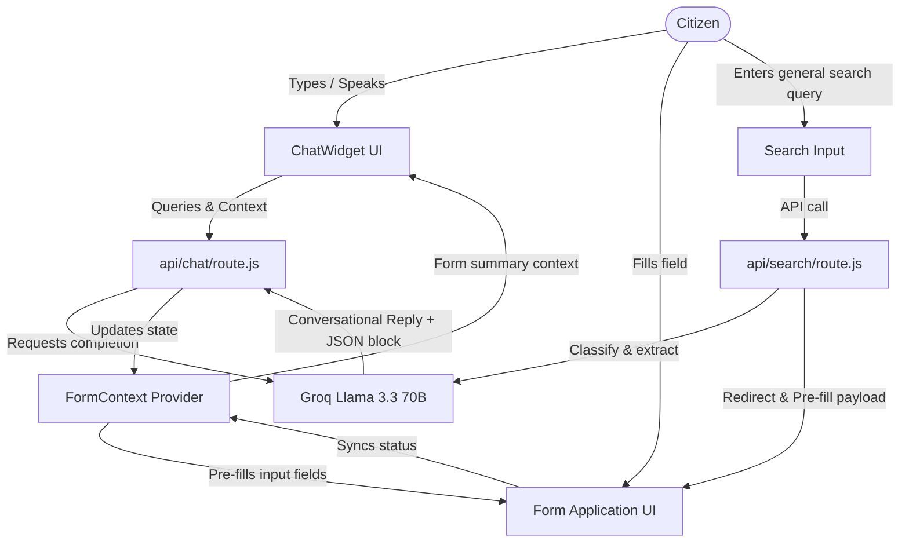

# 🇮🇳 Smart Bharat — GenAI-Powered Civic Companion

Smart Bharat is a state-of-the-art, GenAI-powered civic platform designed to simplify citizen-government interactions. By unifying service discovery, automated form-filling, eligibility evaluation, and complaint tracking into a single digital companion, it bridges the gap between complex bureaucratic procedures and the everyday citizen.

---

## 🌟 Core Vision

Government portals can be fragmented, complex, and difficult to navigate—especially for elderly citizens, individuals with varying literacy levels, or rural populations. Smart Bharat addresses this by introducing a **Voice-First, Multilingual, and Agentic AI Companion** that walks citizens through every step of discovering, applying for, and tracking government services.

---

## 👥 Targeted User Personas

Smart Bharat tailors recommendations, interfaces, and assistance based on 7 core citizen profiles:

1. **🌾 Farmer**: Crop insurance, fertilizer/equipment subsidies (PM-KISAN), land records, and agricultural schemes.
2. **🎓 Student**: Scholarships, educational loans, college admissions, and skill development programs.
3. **💼 Working Professional**: Income tax filing, provident fund (EPF) management, health cards, and driver's licence renewals.
4. **👴 Senior Citizen**: Pension schemes, geriatric healthcare cards (PMJAY), travel concessions, and accessibility features.
5. **🏢 Business Owner**: MSME/Udyam registration, GST filing, trade licences, and commercial permits.
6. **🏡 Homemaker**: Ration cards, LPG subsidies (Ujjwala), women empowerment grants, and primary healthcare schemes.
7. **🔍 Job Seeker**: Skill development, vocational training programs, employment exchanges, and public sector job listings.

---

## 🛠️ Key Features

### 1. AI Civic Companion (`app/components/ChatWidget.jsx`)
A conversational AI assistant that acts as the primary interface.
* **Natural Language Queries**: Handles open-ended questions like *"How do I renew my passport?"* or *"What is PM Mudra Yojana?"*
* **Context-Aware Responses**: Keeps track of current forms and progress.
* **Multilingual Support**: Converse natively in English, Hindi (हिंदी), Telugu (తెలుగు), Tamil (தமிழ்), Kannada (ಕನ್ನಡ), and Bengali (বাংলা).

### 2. Smart Government Service Discovery (`app/services/page.jsx`)
Helps citizens find the exact service they need without wading through multiple departments. Includes personalized recommendations and trending/newly launched programs.

### 3. AI Scheme Eligibility Engine (`app/schemes/page.jsx`)
Analyzes demographics (age, occupation, income, state, category) and outputs:
* Eligible schemes.
* Expected benefits and deadlines.
* Required documents list.

### 4. Agentic Form Filling Assistant (`app/services/apply/page.jsx` & `app/context/FormContext.jsx`)
An automated assistant that simplifies filling lengthy government forms:
* **Interactive Chat Filling**: The user can chat with the AI widget (e.g., *"My name is Rahul Kumar"*), and the AI automatically extracts relevant fields.
* **Visual Progress System**: Displays a completion percentage and highlights filled versus missing required fields.
* **Human-in-the-loop**: Displays data sources, confidence levels, and validation warnings, requiring final user review before submission.

### 5. Document Intelligence Assistant (`app/documents/page.jsx`)
Manages required documentation checklist:
* Secure Citizen Digital Locker (Aadhaar, PAN, certificates).
* Explains the purpose of each document in plain language.
* Automatically flag missing documents required for active applications.

### 6. Civic Issue Reporting & Tracking (`app/report/page.jsx` & `app/track/page.jsx`)
Allows citizens to report public issues (potholes, garbage, water leaks, broken street lights) using:
* Photo upload & voice descriptions.
* Automatic GPS location detection.
* Real-time status tracker (Reported ➡️ Verified ➡️ Assigned ➡️ In Progress ➡️ Resolved).

---

## ⚙️ Technical Architecture & Data Flow



### Backend API Routes
1. **`/api/chat` ([route.js](file:///c:/Users/TNEX/OneDrive/Desktop/smartbharat_ai/app/api/chat/route.js))**:
   Sends conversational history to Groq Cloud. When form-filling is active, it appends the current form's fields to the system instructions. Llama 3.3 generates a conversational response and a structured JSON block delimited by custom tags:
   ```text
   <<<FORM_DATA>>>
   {"fullName": "Rahul Kumar", "state": "Haryana"}
   <<<END_FORM_DATA>>>
   ```
   The backend parses this JSON block, strips it from the user-facing chat bubble, and sends it to the frontend to automatically update the form state.

2. **`/api/search` ([route.js](file:///c:/Users/TNEX/OneDrive/Desktop/smartbharat_ai/app/api/search/route.js))**:
   Analyzes natural language queries from the dashboard search bar. If it matches a supported application (e.g. passport, income certificate, Aadhaar), it extracts any provided user fields directly from the search text, then redirects the user to `/services/apply` with the fields already pre-filled.

### React State Management
* **`FormContext` ([FormContext.jsx](file:///c:/Users/TNEX/OneDrive/Desktop/smartbharat_ai/app/context/FormContext.jsx))**:
  Centralizes active application form metadata. It registers active fields, maps their status (`filled`, `missing`, `manual`), calculates the completion percentage score, and compiles field states into summaries to pass to the Chat API.

---

## 🎨 Accessibility & Design Guidelines

Following the specifications in [design.md](file:///c:/Users/TNEX/OneDrive/Desktop/smartbharat_ai/docs/design%20%284%29.md), Smart Bharat is styled using clean, high-contrast vanilla CSS tokens:

* **Contrast & Color-Blind Safety**: 
  * Uses government blue (`#0B5FFF`), Ashoka green (`#0E7C3A`), and dark amber warnings (`#8A5B00`) which guarantee a **minimum 4.5:1 WCAG contrast ratio** on white.
  * Status and state updates never rely on color alone—they always pair color with text labels and distinct icons.
* **Layout Sizing**: 
  * Default body font size is **18px**, with zero fonts below 16px.
  * Interactive touch targets are sized at a minimum of **44x48px** with **8px spacing** to accommodate tremors or mobility impairments.
* **Accessibility Toggles (Top Nav)**:
  * **Large Text Mode**: Instantly increases all typography sizes by +25% and widens line height to 1.7.
  * **High-Contrast Mode**: Flashes background to pure black (`#000000`), text to white (`#FFFFFF`), and buttons/focus areas to accessible blue outlines (`#66B2FF`).

---

## 📂 Project Structure

```text
smartbharat_ai/
├── app/
│   ├── api/
│   │   ├── chat/             # Conversational Llama chatbot endpoint
│   │   └── search/           # Query parsing and pre-fill classifier
│   ├── components/
│   │   ├── ChatWidget.jsx    # Sticky floating assistant interface
│   │   └── Navbar.jsx        # Navigation & accessibility toggles
│   ├── context/
│   │   └── FormContext.jsx   # State coordinator for active form workflows
│   ├── documents/            # Citizen Digital Locker UI
│   ├── notifications/        # Updates log & deadline alerts
│   ├── profile/              # Citizen Persona configuration
│   ├── report/               # Civic Issue Reporting UI
│   ├── schemes/              # Schemes Explorer & Eligibility Engine
│   ├── services/
│   │   ├── apply/            # Form-filling workspace
│   │   └── page.jsx          # Services Directory
│   ├── globals.css           # Styling rules & Accessibility tokens
│   ├── layout.jsx            # Application wrap template
│   └── page.jsx              # Main Citizen Dashboard
├── docs/
│   ├── prd.txt               # Product Requirements Document
│   ├── agentic_framework.txt # Agentic Form Completion specifications
│   ├── design (4).md         # Design System and Accessibility guides
│   ├── test-chat.js          # Chat API endpoint test runner
│   └── test-search.js        # Search Classification test runner
├── next.config.mjs           # Next.js configurations
└── package.json              # Dependencies (React 19, Next 16, groq-sdk, lucide-react)
```

---

## 🚀 Setup & Local Execution

### 1. Prerequisites
Ensure you have **Node.js (v18+)** installed.

### 2. Environment Configuration
Create a `.env.local` file in the root directory and add your Groq API key:
```env
GROQ_API_KEY=your_groq_api_key_here
```

### 3. Installation
Install the project dependencies:
```bash
npm install
```

### 4. Running the App
Start the local development server:
```bash
npm run dev
```
Open [http://localhost:3000](http://localhost:3000) in your web browser to access the dashboard.

### 5. Running API Tests
Verify the API connection and agentic behavior without running the frontend:
* **Test Chat Auto-fill**:
  ```bash
  node docs/test-chat.js
  ```
* **Test Search Routing & Classification**:
  ```bash
  node docs/test-search.js
  ```

---

## 📄 License & Standards Compliance

Smart Bharat is structured as standard public utility digital infrastructure. Component models follow accessibility checkmarks aligned with WCAG 2.1 Level AA criteria.
